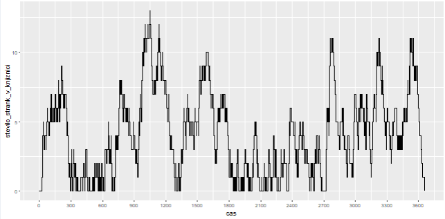
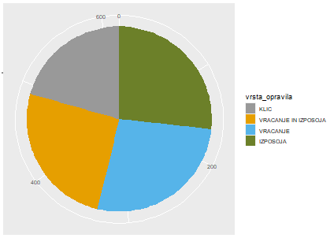
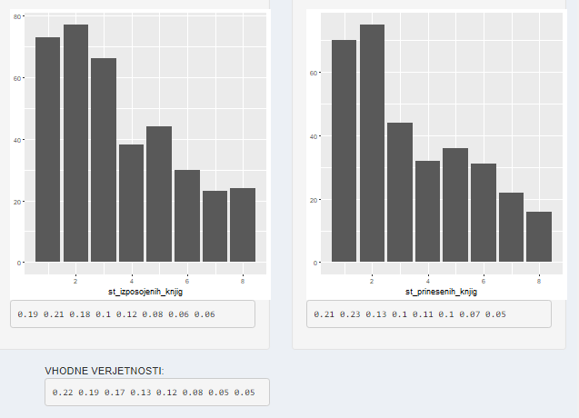

## Opis

Ljudje prihajajo v knjižnico v skladu z eksponentno porazdelitvijo. Nekateri ljudje samo vrnejo knjige, drugi si jih samo izposodijo, nekateri pa si jih tako izposodijo kot vrnejo. Ko oseba vrne knjige, sta dve možnosti. Če se je pri knjižničarju že nabralo dovoljšne število knjig, jih knjižničar odnese na ustrezne police. Vse stranke, ki so takrat pri okencu, počakajo, da se knjižničar vrne. V nasprotnem primeru začne streči novo osebo.

Knjižnica lahko uporablja tudi telefon. Ko se zgodi telefonski klic, sta 2 možnosti. Če je knjižničar pri okencu, se bo javil in bo začasno prekinil serviranje stranke. Po koncu klica bo nadaljeval s strežbo, bo pa rabil dodatnih 5 sekund, ker se je med klicem zmedel. Če knjižničarja ni pri okencu, telefon zvoni nekaj časa. Če se knjižničar pravočasno dokonča pospravljenje knjig, se javi, sicer pa je klic neodgovorjen. Knjižničar ne kliče nazaj.

Ko se knjižničar vrne, nadaljuje s strežbo strank. Tako je vse do zaprtja knjižnice. Od takrat naprej nihče več ne vstopi, knjižničar se tudi ne javlja več na klice. Vseeno pa postreže vse ljudi, ki so bili ob zaprtju že v knjižnici.

## Stanje v knjižnici

Prvi zavihek vsebuje dva grafa, pri čemer zgornji prikazuje število ljudi v vsakem trenutku, spodnji pa prikazuje, kdaj knjižničar nima dela.

## Podatki

V drugem zavihku je napisano število strank v celem dnevu oz. v času opazovanja. Poleg tega je še nekaj podatkov o času čakanja in pa graf, ki prikazuje razporeditev strank glede na opravilo.  

## Primerjava

V zadnjem zavihku pa je primerjava dobljenih podatkov o strankah z vhodnimi podatki. Povsem spodaj so vhodne verjetnosti, nad njimi pa se izriše porazdelitev izposojenih in vrnjenih knjig in ustrezni deleži.

